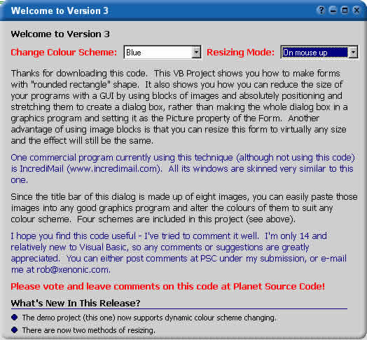



## UPDATE\!  FANTASTIC RESIZABLE skinned form demonstrating forms with non\-standard shapes \* VERSION 3 \*

### Description

This is an update to my popular Resizable Skinned Form. The screenshot below tells you what it looks like and how it works, so this description will only list the new features.

NEW FEATURES IN VERSION 3

~ Dynamic colour scheme changing

~ Two modes of resizing
 
### More Info
 

             |
---                |---
**Submitted On**   |2001-09-02 11:35:06
**By**             |[Rob Wright](https://github.com/Planet-Source-Code/PSCIndex/blob/master/ByAuthor/rob-wright.md)
**Level**          |Intermediate
**User Rating**    |4.8 (195 globes from 41 users)
**Compatibility**  |VB 4\.0 \(32\-bit\), VB 5\.0, VB 6\.0
**Category**       |[Custom Controls/ Forms/  Menus](https://github.com/Planet-Source-Code/PSCIndex/blob/master/ByCategory/custom-controls-forms-menus__1-4.md)
**World**          |[Visual Basic](https://github.com/Planet-Source-Code/PSCIndex/blob/master/ByWorld/visual-basic.md)
**Archive File**   |[UPDATE\!\!  25757922001\.zip](https://github.com/Planet-Source-Code/rob-wright-update-fantastic-resizable-skinned-form-demonstrating-forms-with-non-standard-s__1-26858/archive/master.zip)

### API Declarations

Too many to list ;) Just download it!

